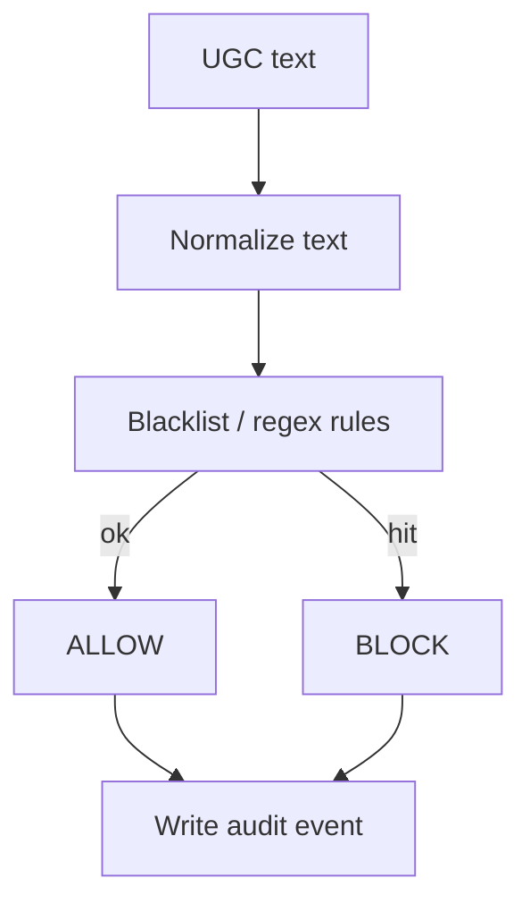
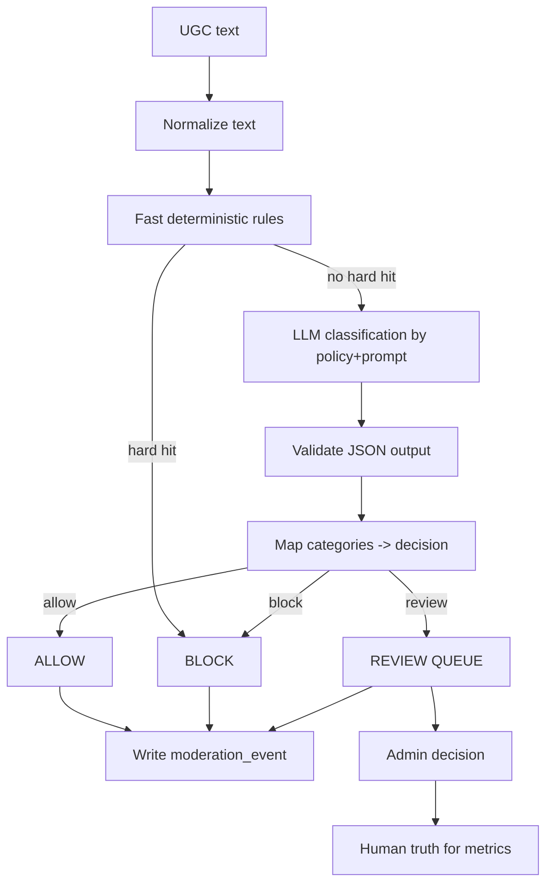
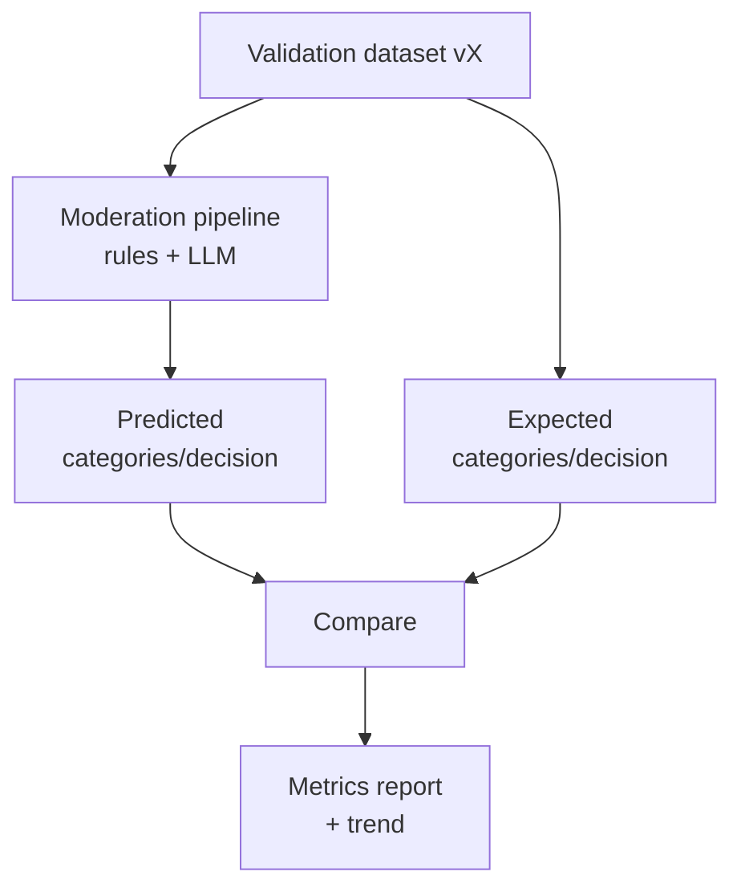

# ML System Design Doc — [RU]
## CARCASE ARENA. AI‑модерация пользовательских кланов — Squads. MVP v1. Итерация 1

Документ: MLSDD‑UGC‑MOD‑001  
Дата: 2026‑02‑23  
Статус: Draft v0.2  

Роли в процессе:
- Product Owner, Squads — бизнес‑требования и критерии успеха пилота
- Trust & Safety / Ops — политика модерации, ручная проверка и операционные процедуры; выполняет роль Global Admin
- Data Scientist / ML Engineer — методология, оценка качества и мониторинг внешней модели

Важно: **архитектура вынесена из design doc отдельно** и не описывается здесь. См. `docs/c4/`, `docs/adr/`, `docs/INTEGRATION.md`, `docs/DATA_MODEL.md`, `spec/openapi.yaml`.

---

### Термины и определения

- UGC — user-generated content, пользовательский контент. В этом документе: названия и описания кланов.
- Клан — пользовательская группа игроков с публичными атрибутами: название и описание. В продукте эта сущность называется Squads; далее используем термин “клан”.
- Решение модерации:
  - `allow` — разрешить публикацию или изменение
  - `block` — отклонить запрос
  - `review` — отправить в ручную очередь; финальное решение принимает человек
- Global Admin — глобальный модератор продукта: принимает решения по `review` и при необходимости редактирует текст.
- Human truth — итоговое решение человека по кейсу; используется как “истина” для оценки качества.
- Validation dataset (golden set) — оффлайн‑набор размеченных примеров для регулярной оценки качества и регрессионных проверок при изменениях `policy/prompt/model`. Может включать синтетические кейсы и примеры из ручной очереди `review` после анонимизации.
- FP/FN — ложное срабатывание и пропуск нарушения.
- DAU/MAU — дневная и месячная активная аудитория.
- LTV — lifetime value, пожизненная ценность пользователя.
- Барьерные метрики — показатели, которые нельзя ухудшать при внедрении.

---

### 1. Цели и предпосылки

#### 1.1. Зачем идем в разработку продукта?

- Бизнес‑цель
  - Оптимизировать расходы на модерацию UGC. Автоматизировать проверку названия и описания клана и заменить постоянную ручную модерацию оплатой API‑вызовов внешней LLM; человеку оставлять только пограничные случаи со статусом `review`.
  - Безопасно масштабировать механику “кланы” при росте аудитории. Не допускать токсичный и запрещённый контент в публичные интерфейсы продукта — списки, поиск, лидерборды — снижая риск жалоб, санкций платформы и оттока пользователей. Это защищает выручку и LTV продукта.

- Контекст и масштаб
  - Зарегистрированные пользователи: ~200k
  - MAU: ~40k
  - DAU: ~6k
  - Лидерборды — одна из ключевых механик соревнования. Значимая доля активных пользователей регулярно видит витрины и рейтинги, поэтому названия и описания кланов имеют высокую видимость.

- Почему нужен ML/LLM, а не только правила
  - Правила на словарях и регулярных выражениях плохо покрывают:
    - обфускации: разделители, символы, замены букв,
    - контекстные оскорбления без “плохих слов”,
    - рекламу, скам и персональные данные,
    - смешанные языки RU/EN.
  - LLM‑классификатор по нашей политике модерации:
    - покрывает больше типов нарушений без разработки и обучения собственной модели на старте,
    - возвращает категорию и короткое объяснение для аудита и админ‑решений,
    - позволяет выстроить `review` и собирать human truth для контроля качества внешней модели.
  - Экономика:
    - API внешней LLM дешевле и быстрее вывода в прод, чем развёртывание и сопровождение собственной модели и инференс‑инфраструктуры при переменной нагрузке.
    - Это переводит затраты из фиксированной стоимости ручной модерации в переменные расходы на токены, которые зависят от объёма операций и контролируются лимитами.

- Определение успеха итерации
  - Явные нарушения не публикуются.
  - Пограничные случаи уходят в `review` и решаются модератором в пределах SLA.
  - Барьерные метрики — конверсия, задержка, ошибки, стоимость — остаются в допустимых пределах.

#### 1.2. Бизнес‑требования и ограничения

- Требования
  - Модерируем два текстовых поля клана: название и описание.
  - Точки применения: создание клана и редактирование описания.
  - Результат модерации: `allow | block | review` плюс категории нарушений и `reason_short` для логов и админ‑интерфейса.
  - Модерация выполняется до публикации, так как тексты кланов попадают в публичные витрины, включая лидерборды.

- Текущий процесс
  - Без превентивной модерации система вынуждена реагировать пост‑фактум: репорты и ручные правки.
  - Такой подход плохо масштабируется при росте UGC и не защищает лидерборды от инцидентов.

- Целевой процесс
  - Превентивная автоматическая модерация для большинства кейсов.
  - Ручная проверка для `review`, где риск ошибки максимален.

- Плановая нагрузка и стоимость
  - Ниже — плановые предположения. После запуска уточняются по логам за 1–2 недели.
  - При DAU ~6k:
    - создание кланов: ~0.5–2% DAU в день → ~30–120 созданий/день, ~210–840/неделя
    - пик на запуске фичи: ~90–180 созданий/день, ~630–1,260/неделя
    - редактирование описаний: ~0.5–1.5× от числа созданий
  - Оценка числа LLM‑проверок:
    - создание клана: 2 проверки — название и описание
    - редактирование: 1 проверка — описание
    - планово: ~100–350 LLM‑запросов/день, пик: ~225–630/день до включения кэширования

- Ограничения
  - Справедливость: если за создание клана взимается плата во внутриигровой валюте, её нельзя списывать при `block` и при `review`, который завершился отказом.
  - UX: сообщения пользователю нейтральные и понятные; без раскрытия внутренних категорий и “текста правил”.
  - Приоритет рисков: при неопределённости предпочтительнее `review` или `block`, чем пропуск нарушения.
  - Операции: очередь `review` должна быть управляемой; SLA ручной проверки — ≤ 24 часа.
  - Compliance: запрещённый контент должен блокироваться строго.
  - Данные:
    - в LLM передаём только текст и тип поля; без пользовательских идентификаторов и лишнего контекста
    - доступ к логам и текстам ограничен для Ops/Trust & Safety
    - сырой текст хранится ограниченно по времени для `block` и `review` — ориентир 90 дней; для `allow` достаточно хэша или нормализованного текста и метаданных
  - Стоимость:
    - запрос и ответ короткие, ответ строго структурирован
    - кэширование по нормализованному тексту
    - лимит расходов через hard cap по числу LLM‑запросов в сутки. Ориентир: 2,000–5,000. Алертинг на 70–80% лимита.

- Критичные категории
  - Для этих категорий решение должно быть `block`, либо `review`, если классификация неуверенная:
    - hate / extremism / terror
    - sexual, включая любые упоминания несовершеннолетних в сексуальном контексте
    - self-harm: призывы и инструкции
    - прямые угрозы насилия
    - scam/ads/spam: реклама, фишинг, мошенничество
    - PII/doxxing: телефоны, адреса, персональные данные

- Экономический эффект
  - Ручная модерация каждого создания и редактирования при ~150–300 операций в день и 30–60 секунд на решение даёт ~1.25–5 часов работы в день.
  - Это примерно ~0.3–1.0 FTE с учётом необходимости регулярного покрытия.
  - Автоматизация через LLM позволяет:
    - снять необходимость в выделенной штатной роли модератора на полный день для большинства кейсов,
    - оплачивать предсказуемую стоимость запросов вместо зарплатных затрат,
    - оставлять человеку только пограничные случаи и тем самым удерживать ручную нагрузку в управляемых пределах.
  - Цель: `review` ≤ 10% операций, тогда ручная нагрузка остаётся на уровне десятков кейсов в сутки.

- Что ожидаем от текущей итерации
  - Запустить модерацию в режиме MVP:
    - LLM‑классификация и решения `allow/block/review`
    - очередь `review` и ручные решения модератора
    - аудит событий и версионирование policy/prompt
    - validation dataset (golden set) для оффлайн‑оценки качества и регрессионных проверок
    - базовые метрики качества и метрики работы сервиса

- Как используется модерация в пилоте
  - Создание или редактирование клана:
    - `allow` — публикуем
    - `block` — отклоняем, пользователь может сразу исправить
    - `review` — не публикуем, отправляем в очередь
  - Для `review`:
    - создание — плата за создание, если она есть, списывается только после approve
    - редактирование — сохраняем старое описание до approve
  - Модератор принимает решение: approve / reject / edit+approve

- Что считаем успешным пилотом и как развиваемся дальше
  - Пилот успешен, если запрещённый UGC перестаёт попадать в публикацию и барьерные метрики соблюдаются.
  - Дальше: расширяем покрытие, улучшаем policy/prompt, автоматизируем формирование validation dataset (golden set) и оптимизируем стоимость.

#### 1.3. Что входит в скоуп итерации и что не входит

- Входит
  - Модерация названий и описаний кланов при создании и редактировании.
  - Категории нарушений и правила маппинга в `allow/block/review`.
  - Контур `review` и сбор human truth.
  - Метрики качества и базовый мониторинг.

- Не входит
  - Модерация чатов, никнеймов, изображений и медиа.
  - Автоматическое переписывание текста.
  - Обучение собственной модели с нуля.
  - Полноценный пользовательский процесс апелляций. Можно добавить позже.

- Качество и воспроизводимость
  - Артефакты policy/prompt/spec версионируются в git; версии фиксируются в аудит‑событиях.
  - Validation dataset версионируется отдельно; результаты evaluation сохраняются как отчёты, чтобы сравнивать качество между версиями `policy/prompt/model`.
  - Решение максимально детерминировано:
    - temperature=0
    - строгий структурированный ответ
    - кэширование по нормализованному тексту
  - Любые изменения policy/prompt обратимы по версиям.

- Технический долг
  - Policy и промпт уточняются по реальным данным и типовым ошибкам.
  - Golden set на старте небольшой и ручной; автоматизация процесса — позже.
  - Покрытие языков кроме RU/EN уточняется по фактической аудитории.

#### 1.4. Предпосылки решения

- Точки модерации ограничены созданием и редактированием кланов.
- Нагрузка в MVP — сотни LLM‑запросов в сутки; стоимость контролируется лимитами и кэшированием.
- Модель — внешний LLM‑провайдер. Поэтому обязательны:
  - аудит решений и версий артефактов
  - мониторинг качества на human truth
  - стратегия деградации при сбоях: вместо “пустить” отправлять в `review`

---

### 2. Методология

#### 2.1. Постановка задачи

Это policy‑based модерация текста:
- multi‑label классификация: текст → категории нарушений
- маппинг категорий в решение `allow/block/review`

Требования к системе:
- предсказуемость: низкая случайность, temperature=0
- проверяемость: аудит и human truth
- управляемость: rollout/rollback и очередь `review`

Контур оценки качества и контроля внешней модели:
- validation dataset (golden set) — фиксированный оффлайн‑набор “пример → ожидаемый результат” для:
  - регрессионных проверок при изменениях `policy/prompt/model`,
  - периодической переоценки качества внешней LLM на одном и том же наборе,
  - мониторинга деградаций/дрейфа качества провайдера.
- human truth — решения модератора по очереди `review` и выборочный аудит авто‑решений. Это источник “истины” на прод‑потоке и основа для метрик качества в реальной среде.

#### 2.2. Блок‑схема решения

Бейзлайн:

Основной MVP:

Offline‑оценка качества на validation dataset:

#### 2.3. Этапы решения задачи

Ниже — этапы итерации 1. Для каждого этапа фиксируем вводные, технику решения, результат, риски и способ бизнес‑проверки.

##### Этап 1 — Данные и сущности. EDA и подготовка контура “истины”

Данные и сущности:
- объект модерации: название и описание клана
- целевая переменная: итоговое решение человека по кейсу `review` плюс категории, если размечаем
- признаки: `text_raw`, `text_norm`, язык/длина, тип поля и действие; минимальный внутренний контекст для аудита. В LLM‑провайдер эти данные не передаются.
- validation dataset: набор примеров “вход → expected categories/decision” с версией датасета; формируется как синтетика плюс human truth из `review` после анонимизации. Используется только оффлайн.

Таблица источников данных для MVP:

| Название данных | Наличие | Ресурс | Качество |
| --- | --- | --- | --- |
| События создания/редактирования клана | Да — Mini App backend | Backend Engineering | частично (валидация форматов уже есть) |
| Таблицы продукта `squads`, `squad_members` | Да — Postgres продукта | Backend Engineering | да (используются продуктом) |
| `moderation_events` — аудит решений | Будет создано | Backend Engineering + ML Engineering | нет (создаётся и валидируется) |
| `moderation_review_queue` — очередь и решения | Будет создано | Backend Engineering + Ops | нет (создаётся и валидируется) |
| Validation dataset v1 (golden set) — синтетика + human truth из `review` | Будет создано | Ops + ML Engineering | нет (создаётся и валидируется) |

Результат этапа:
- согласованный список категорий и правила маппинга в `allow/block/review`
- схема данных аудита и очереди review. См. `docs/DATA_MODEL.md`
- план формирования validation dataset (golden set): размер, стратификация, ответственные
- описание формата и стратегии использования датасета (smoke/full, частота прогонов, лимиты стоимости). См. `docs/QUALITY_EVALUATION.md`.

Риски и что делаем:
- при отсутствии размеченной “истины” опираемся на контур `review` и формируем validation dataset как минимальный источник правды

Бизнес‑проверка:
- подтверждение категорий и правил решения со стороны владельца продукта и модерации

##### Этап 2 — Бейзлайн и baseline‑оценка

Бейзлайн:
- нормализация текста плюс blacklist/regex как быстрый контроль

Оценка:
- формируем validation dataset v1 (golden set): синтетические кейсы + размеченные примеры из `review`
- делаем два набора:
  - smoke/regression (сотни примеров) — быстрые регулярные проверки
  - full (тысячи/десятки тысяч примеров) — периодическая полная оценка
- считаем baseline метрики для `block` — precision/recall — на validation dataset
- считаем критичный FN‑контроль: кейсы, где `expected=block`, но бейзлайн даёт `allow`
- фиксируем типовые FP/FN и пробелы baseline для приоритизации улучшений

Примечание: детали подхода к validation dataset вынесены в `docs/QUALITY_EVALUATION.md`.

Результат этапа:
- baseline метрики и список типовых FP/FN
- понимание, какие ошибки baseline закрывает плохо и что улучшает LLM

Риски:
- baseline недостаточно точный; важно контролировать, чтобы LLM не ухудшал барьерные метрики и не перегружал review‑очередь

##### Этап 3 — MVP LLM‑классификатор. Policy + prompt

Техника:
- LLM на базе OpenAI GPT в режиме классификации по нашей policy
- ответ строго JSON, валидируем по схеме
- temperature=0
- короткое `reason_short` только для логов и админ‑интерфейса
- версионирование `policy_version`, `prompt_version`, `model` в каждом событии

Оценка:
- на validation dataset (golden set) считаем precision/recall для `block` и долю `review`
- smoke‑набор используем как регрессионный тест при изменении `policy/prompt/model`
- дополнительно считаем метрики по ключевым категориям policy и контролируем критичный FN (expected block → predicted allow)

Результат этапа:
- работающий классификатор со стабильным контрактом и управляемыми решениями

Риски:
- попытки обойти правила и prompt injection → строгая схема ответа, нормализация, rate limit
- дрейф внешней модели → мониторинг качества и staged rollout

Бизнес‑проверка:
- демо на примерах “до/после” и разбор пограничных кейсов вместе с владельцем продукта

##### Этап 4 — Human-in-the-loop. Очередь `review` и решения модератора

Техника:
- `review` создаёт запись в очереди
- модератор принимает решение approve/reject/edit+approve
- решения модератора становятся human truth для метрик качества

Результат этапа:
- по пограничным кейсам финальное решение не принимается автоматически; применяется ручная проверка

Риски:
- очередь растёт → контролируем долю `review`, добавляем правила и кэширование, упрощаем policy

##### Этап 5 — Пилот. Staged rollout и shadow mode

Техника:
- shadow mode: опционально считаем решения LLM без влияния на продукт и сравниваем с human truth
- перед переходом на следующий этап rollout прогоняем smoke‑набор validation dataset как регрессионный контроль; при просадке качества откатываем `policy/prompt/model`
- staged rollout: 0% → 10% → 50% → 100% трафика; стабильный сплит по user_id; сначала включаем создание, затем редактирование

Результат этапа:
- подтверждение бизнес‑эффекта и соблюдения барьерных метрик; план выхода на 100%

---

### 3. Подготовка пилота

#### 3.1. Способ оценки пилота

Дизайн:
- staged rollout через feature flag на операции создания и редактирования клана
- сравниваем:
  - долю нарушений по ручной проверке сэмплов и по решениям модератора
  - метрики качества на validation dataset (оффлайн): регрессионные проверки и периодическая переоценка
  - барьерные метрики: конверсия, задержка, ошибки, стоимость
  - операционные метрики: доля `review` и SLA обработки очереди

Группы:
- стабильный сплит по user_id, чтобы пользователь всегда попадал в одну и ту же группу

#### 3.2. Что считаем успешным пилотом

Качество:
- `precision_block` ≥ 0.90 на validation dataset v1 (golden set). Это стартовая цель; уточняется после baseline.
- `review_rate` ≤ 10% от всех операций создания и редактирования. Иначе ручная очередь не масштабируется.
- `override_rate` со временем снижается и стабилизируется. Ориентир: ≤ 5% после калибровки policy/prompt.

Бизнес‑метрики:
- доля запрещённого UGC, дошедшего до публикации, снижается относительно baseline; оцениваем по ручной проверке сэмплов

Барьерные метрики:
- конверсия в создание и редактирование не падает более чем на 1–3 п.п. относительно контроля
- p95 задержка модерации укладывается в пользовательский SLA. Ориентир: ≤ 1–2 секунды на операцию.
- error rate модерации ≤ 1%; при сбоях используется деградация в `review`

Операционные критерии:
- SLA обработки очереди `review` — 24 часа
- при целевом `review_rate` ожидаемая ручная нагрузка находится на уровне десятков кейсов в сутки и укладывается в SLA

#### 3.3. Подготовка пилота. Затраты и ограничения

Чтобы пилот был реализуемым по стоимости:
- модерация вызывается только на создание и редактирование, не на каждый ввод символа
- ограничиваем длину текста и длину ответа
- ограничиваем размер ответа строгим JSON и лимитом на tokens
- кэшируем решения по `hash(text_norm, field, policy_version, prompt_version)` и используем TTL
- используем более дешёвую модель для классификации и сохраняем возможность переключения модели через конфиг

Бюджет‑гейт:
- hard cap по LLM‑запросам в сутки. Ориентир: 2,000–5,000 в зависимости от фактического объёма операций.
- алертинг на достижение 70–80% лимита
- уточнение лимитов после 1–2 недель фактических логов

Отдельный бюджет на оценку качества (validation dataset):
- частые проверки — smoke‑набор (сотни примеров), чтобы быстро ловить регрессии
- полная переоценка — full‑набор (тысячи/десятки тысяч) по расписанию или вручную
- лимиты на число примеров и rate limit, чтобы evaluation не конкурировал с прод‑нагрузкой

---

### 4. Внедрение

Раздел архитектуры, интеграции и инфраструктуры вынесен в отдельные документы:
- `docs/INTEGRATION.md`
- `docs/DATA_MODEL.md`
- `docs/c4/`
- `docs/adr/`
- `spec/openapi.yaml`
