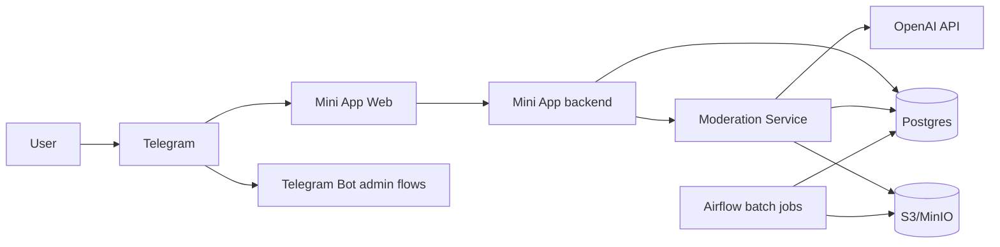

# C4 — System Context (draft)

```mermaid
flowchart LR
  U[User] --> TG[Telegram];
  TG --> MA[Mini App Web];
  MA --> BE[Mini App backend];
  TG --> BOT[Telegram Bot admin flows];
  BE --> MS[Moderation Service];
  MS --> LLM[OpenAI API];
  BE --> PG[(Postgres)];
  MS --> PG;
  MS --> S3[(S3/MinIO)];
  BATCH[Airflow batch jobs] --> PG;
  BATCH --> S3;
```
